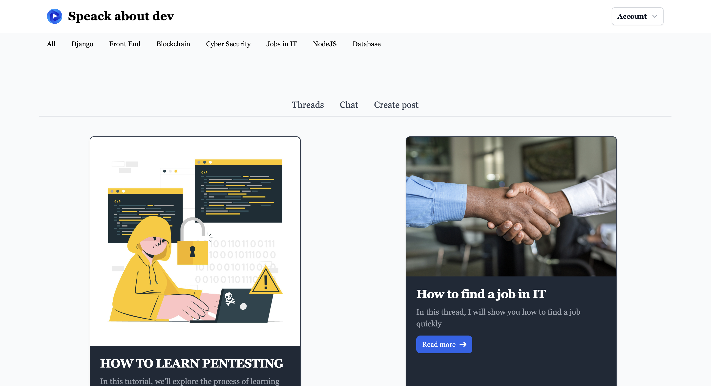
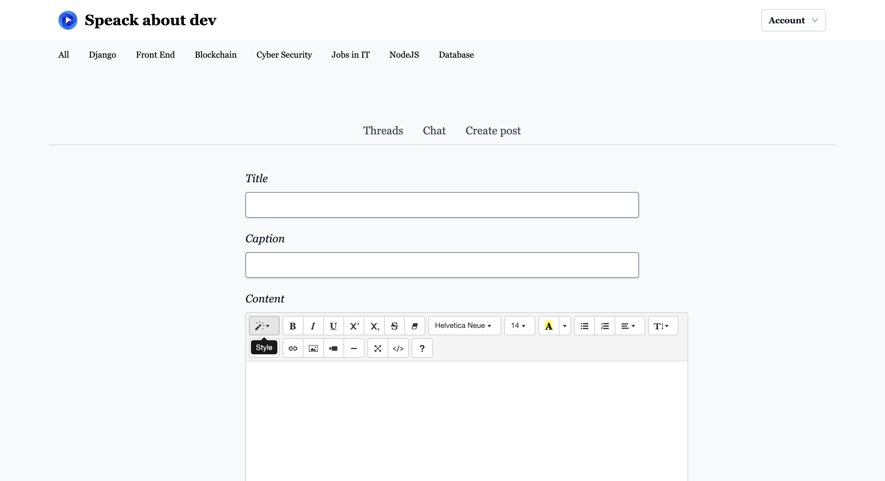

# Blog Django website

This is a blog website built with Django, javascript and tailwind.
You need to have python installed.

Website purpose : practice




KEY FEATURES :

- tailwind css integration
- admin management

- Users :
    - change password
    - register
    - login
    - logout
    - reset password
    - edit account
- Profile (extends Users):
    - image

- Posts :
    - create Post
        - text edito integration (django-summernote)
    - order form
    - see all posts
    - see a post


```bash
```


# Install 
```bash
git clone https://github.com/sam-gvt/social_network_django.git

pip install -r requirements.txt
```


# Create your database
```bash
python manage.py makemigrations
python manage.py migrate
```

# Start server 
```bash
python manage.py runserver
```

## License

[MIT](https://choosealicense.com/licenses/mit/)